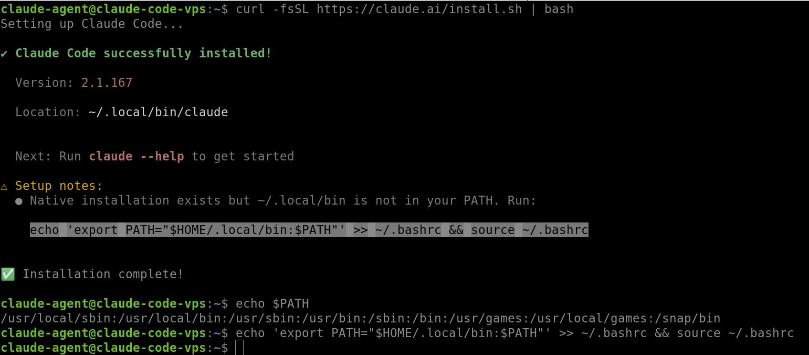

# Setting Up Claude Code
Find official documentation [here](https://code.claude.com/docs/en/overview).


#### 1. Apply best practices
- Make sure a dedicated user is configured with access to sudo without password
- Establish a SSH session to the VPS with that user
- run a screen session


#### 1. Install Claude code

- Run the command
```bash
curl -fsSL https://claude.ai/install.sh | bash
```
- Follow the setup notes if needed (Update the PATH)


- Create a working directory(claud considers this as the project root)
```bash
mkdir sysadmin
cd sysadmin
```

- Verify the installation
```bash
claude doctor

# or

claude
```

- Select a terminal theme(Dark mode is the default)

- On the welcom screen, choose the `Login Method`:
```
 Claude Code can be used with your Claude subscription or billed based on API usage through your Console account.

 Select login method:

 ❯ 1. Claude account with subscription · Pro, Max, Team, or Enterprise
   2. Anthropic Console account · API usage billing
   3. 3rd-party platform · Amazon Bedrock, Microsoft Foundry, or Vertex AI
```

>[!NOTE]
>
> - Claude code will open the browser so you can sign in (Or generate a URL for you if not)
> - Sign in to the claude/Third party console in the browser And hit Authorize button.
> - Copy the generated code in the browser and paste it in your CLI and press Enter to login.

- The agent is up and running